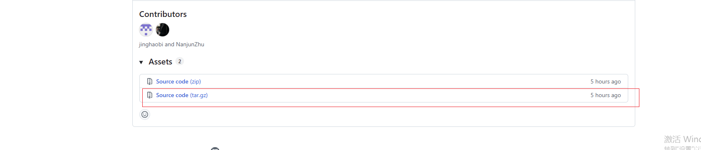

# Emei - 临床试验数据质量检查R包


[](https://www.repostatus.org/#active) []()

## 📋 简介

**Emei** 是一个专门用于临床试验SDTM数据质量检查的R包。它提供了一键式的数据验证功能，能够自动读取、预处理和检查SDTM数据，并生成详细的Excel检查报告。

### 核心特点

-   ✅ **一键执行** - 单个函数完成所有检查流程
-   ✅ **自动化处理** - 自动读取SAS数据、合并SUPP域、预处理
-   ✅ **全面检查** - 覆盖DM、AE、VS、LB、EX、CM、EC、TR、TU、RS、SS、TS、QS等主要域
-   ✅ **灵活配置** - 可按优先级和类型筛选检查项目
-   ✅ **Excel报告** - 自动生成格式化的检查报告
-   ✅ **生产级质量** - 499个测试用例，100%通过率

## 🚀 快速开始

### 安装

``` r
# 1.从GitHub安装
# install.packages("devtools")
devtools::install_github("Pharma-Mountain-High/emei", ref = "v1.0.0")
# install.packages("remotes")
remotes::install_github("Pharma-Mountain-High/emei@v1.0.0")

# 2.下载后再安装
# 打开网址下载压缩包文件(tar.gz)

https://github.com/Pharma-Mountain-High/emei/releases/tag/v1.0
```  


``` r 
# 下载的实际位置替换掉xxx
install.packages("xxx/xxx.tar.gz", repos = NULL, type = "source")
```    
### 加载包

``` r
library(Emei)
```

## 💡 核心功能：emei()

### 基本用法

`emei()` 是包的核心函数，提供一键式SDTM数据质量检查：

``` r
# R server最简单的用法
result <- emei(
  proj = "QLC5508-301",
  folder = "~/STA-Server/Projects02/QLC5508/QLC5508-301/SP/dryrun/data/sdtm"
)
```

这个函数会自动完成以下工作：

1.  ✅ 读取指定目录下的所有`.sas7bdat`文件
2.  ✅ 自动合并SUPP数据集到主域
3.  ✅ 对DM、AE、VS域进行标准化预处理
4.  ✅ 执行全面的数据质量检查
5.  ✅ 生成Excel格式的检查报告

### 函数参数说明

| 参数           | 类型     | 必需  | 默认值                     | 说明                                          |
|----------------|----------|-------|---------------------------|---------------------|
| `proj`         | 字符串   | ✅ 是 | -                          | 项目编号，用于报告文件命名（如"QLG2198_301"） |
| `folder`       | 字符串   | ✅ 是 | -                          | SDTM数据目录路径                              |
| `priority`     | 字符向量 | 否    | `c("High","Medium","Low")` | 检查优先级筛选                                |
| `type`         | 字符向量 | 否    | `c("ALL","ONC","PRO")`     | 检查类型筛选                                  |
| `export_excel` | 逻辑值   | 否    | `TRUE`                     | 是否导出Excel报告                             |
| `outdir`       | 字符串   | 否    | `"report"`                 | 报告输出目录                                  |
| `save_rds`     | 逻辑值   | 否    | `FALSE`                    | 是否保存原始数据为RDS文件                     |
| `verbose`      | 逻辑值   | 否    | `TRUE`                     | 是否显示运行信息                              |

### 使用示例

#### 基本使用

``` r
# 最简单的用法（使用默认配置进行全面检查）
result <- emei(
  proj = "QLC5508-301",
  folder = "~/STA-Server/Projects02/QLC5508/QLC5508-301/SP/dryrun/data/sdtm"
)

# 输出：
# Reading 15 .sas7bdat file(s)...
# Merging SUPP: suppae -> ae
# Merging SUPP: suppdm -> dm
# Running checks...
# Report generated: report/QLC5508-301_sdtm_checks_report_2026-02-27.xlsx
```

#### 修改参数

在基本用法的基础上，可以根据需要修改参数：

``` r
# 1. 只检查高优先级
result <- emei(
  proj = "QLC5508-301",
  folder = "~/STA-Server/Projects02/QLC5508/QLC5508-301/SP/dryrun/data/sdtm",
  priority = "High"  # 或 c("High", "Medium")
)

# 2. 只检查肿瘤相关项目
result <- emei(
  proj = "QLC5508-301",
  folder = "~/STA-Server/Projects02/QLC5508/QLC5508-301/SP/dryrun/data/sdtm",
  type = "ONC"  # 或 c("ALL", "ONC")
)

# 3. 不导出Excel，只返回结果对象
result <- emei(
  proj = "QLC5508-301",
  folder = "~/STA-Server/Projects02/QLC5508/QLC5508-301/SP/dryrun/data/sdtm",
  export_excel = FALSE
)

# 4. 自定义输出目录
result <- emei(
  proj = "QLC5508-301",
  folder = "~/STA-Server/Projects02/QLC5508/QLC5508-301/SP/dryrun/data/sdtm",
  outdir = "~/quality_reports/2026-02"
)

# 5. 保存原始数据（用于调试）
result <- emei(
  proj = "QLC5508-301",
  folder = "~/STA-Server/Projects02/QLC5508/QLC5508-301/SP/dryrun/data/sdtm",
  save_rds = TRUE  # 生成 source_data_QLC5508-301.rds
)

# 6. 静默模式（不显示运行信息）
result <- emei(
  proj = "QLC5508-301",
  folder = "~/STA-Server/Projects02/QLC5508/QLC5508-301/SP/dryrun/data/sdtm",
  verbose = FALSE
)

# 7. 组合多个参数
result <- emei(
  proj = "QLC5508-301",
  folder = "~/STA-Server/Projects02/QLC5508/QLC5508-301/SP/dryrun/data/sdtm",
  priority = c("High", "Medium"),  # 只检查高和中优先级
  type = c("ALL", "ONC"),          # 检查通用和肿瘤相关
  outdir = "~/reports",            # 自定义输出目录
  save_rds = TRUE,                 # 保存原始数据
  verbose = TRUE                   # 显示运行信息
)
```

## 📊 检查报告

### Excel报告内容

自动生成的Excel报告包含：

-   **检查摘要** - 通过/失败的检查项统计
-   **详细结果** - 每项检查的具体结果
-   **问题记录** - 未通过检查的具体数据记录
-   **优先级标记** - High/Medium/Low分类
-   **检查类型** - ALL/ONC/PRO分类

### 报告文件命名规则

```         
{项目编号}_sdtm_checks_report_{日期}.xlsx
```

示例：
- `QLC5508-301_sdtm_checks_report_2026-02-27.xlsx`


### 访问报告路径

``` r
result <- emei(
  proj = "QLC5508-301",
  folder = "~/STA-Server/Projects02/QLC5508/QLC5508-301/SP/dryrun/data/sdtm"
)

# 获取生成的报告路径
report_path <- attr(result, "outfile")
print(report_path)

# 在系统中打开报告
system(sprintf('start "" "%s"', report_path))  # Windows
# system(sprintf('open "%s"', report_path))      # macOS
# system(sprintf('xdg-open "%s"', report_path))  # Linux
```

## 🎯 检查覆盖范围

Emei包执行以下类型的数据质量检查：

### 通用检查 (ALL)

-   ✅ **DM域** - 受试者人口学信息一致性
-   ✅ **AE域** - 不良事件数据完整性和逻辑性
-   ✅ **VS域** - 生命体征数据合理性
-   ✅ **LB域** - 实验室检查数据完整性
-   ✅ **EX域** - 暴露数据一致性
-   ✅ **CM域** - 合并用药数据完整性
-   ✅ **DS域** - 处置数据逻辑性

### 肿瘤相关检查 (ONC)

-   ✅ **TU域** - 肿瘤识别数据
-   ✅ **TR域** - 肿瘤评估数据
-   ✅ **RS域** - 疾病反应评估
-   ✅ **EC域** - 暴露-合并用药数据

### PRO检查 (PRO)

-   ✅ **QS域** - 问卷数据完整性

### 支持的检查类型

-   数据完整性检查（缺失值、必需变量）
-   数据一致性检查（跨域关联）
-   逻辑性检查（日期顺序、数值范围）
-   CDISC标准符合性检查

## 📁 目录结构要求

### SDTM数据目录

```         
sdtm/
├── dm.sas7bdat          # 人口学域（必需）
├── ae.sas7bdat          # 不良事件域
├── vs.sas7bdat          # 生命体征域
├── lb.sas7bdat          # 实验室检查域
├── ex.sas7bdat          # 暴露域
├── cm.sas7bdat          # 合并用药域
├── ds.sas7bdat          # 处置域
├── suppae.sas7bdat      # AE补充数据（自动合并）
├── suppdm.sas7bdat      # DM补充数据（自动合并）
└── ...                  # 其他域
```

### 输出目录结构

```         
report/
├── QLG2198_301_sdtm_checks_report_2026-02-27.xlsx
├── QL1706_308_sdtm_checks_report_2026-02-27.xlsx
└── ...
```

## 📖 最佳实践

### 1. 在数据锁定前运行检查

``` r
# 在数据库锁定前执行完整检查
result <- emei(
  proj = "QLG2198_301",
  folder = "~/Projects/QLG2198-301/data/sdtm",
  priority = c("High", "Medium", "Low"),
  save_rds = TRUE  # 保存原始数据便于后续核查
)
```

## ❓ 常见问题

### Q: 如果数据目录中没有某些域会怎样？

A: 没关系。`emei()`会智能跳过不存在的域的相关检查。只检查实际存在的数据。

### Q: 可以同时运行多个项目吗？

A: 可以，但建议在不同的R会话中运行，因为函数会将数据加载到全局环境中。

### Q: 支持其他数据格式吗？

A: 当前版本仅支持`.sas7bdat`格式。其他格式请先转换。

### Q: 检查规则可以自定义吗？

A: 检查规则基于CDISC SDTM标准和临床数据管理最佳实践。如需自定义，可以直接调用底层的检查函数。

### Q: Excel报告太大怎么办？

A: 可以使用`priority`和`type`参数筛选检查项，或设置`export_excel = FALSE`只获取结果对象进行定制化处理。

## 📊 技术指标

-   **测试覆盖**: 499个测试用例，100%通过率
-   **支持的域**: 14+个SDTM域
-   **检查函数**: 85+个专业检查函数
-   **报告格式**: Excel (.xlsx)
-   **数据格式**: SAS (.sas7bdat)

## 📝 更新日志

### Version 0.1.0 (2026-02-27)

-   ✅ 实现核心`emei()`函数
-   ✅ 支持14+个SDTM域的全面检查
-   ✅ 自动SUPP域合并功能
-   ✅ Excel报告生成功能
-   ✅ 499个测试用例，100%通过率
-   ✅ 修复check_ex_extrt_exoccur函数bug

## 📄 许可证

本项目采用 [许可证名称] 许可证 - 详见 LICENSE 文件

## 📞 支持

-   问题反馈: [GitHub Issues](https://github.com/Pharma-Mountain-High/emei/issues)


## 🔗 相关资源

-   [CDISC SDTM标准](https://www.cdisc.org/standards/foundational/sdtm)
-   [R语言官方文档](https://www.r-project.org/)

------------------------------------------------------------------------

**一键执行，全面检查，让临床试验数据质量控制更简单！** 🚀
